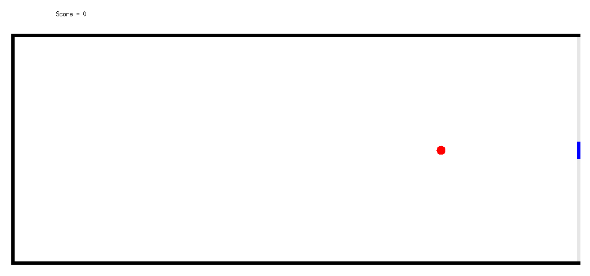

---
author:
  - Raphaël Monat
  - Lucas Baudin
  - Martin Pépin
  - Auguste Olivry
---

\

Nous avons réalisé un compilateur de minilustre vers Rust. Nous avons d'abord suivi
l'architecture proposée dans l'article donné en référence[^ref1], mais nous nous sommes attachés à produire un
compilateur vérifiable. Il est modulaire, il s'organise en plusieurs passes
distinctes disposant souvent de leur propre type d'AST : parsing, typage, clocking,
normalisation, ordonnancement, optimisation et production de code objet. Pour la plupart
de ces passes, nous avons des arguments pour garantir une certaine correction. Pour le
typage, nous utilisons des GADTs, donnant des ASTs bien typés par constructions. Pour d'autres,
comme l'ordonnancement et le clocking, nous avons des fonctions de vérification. Le type
d'AST utilisé après la normalisation garantie aussi la bonne formation des ASTs.

Puis, tout un second volet de notre travail a été consacré à une extraction vers Why3.
Cette extraction permet, outre l'utilisation d'un langage particulièrement sûr, de
produire, sur un noyau de minilustre, une preuve de correction sémantique pour chaque
extraction.
Au contraire d'un compilateur formellement vérifié[^ref2], la
correction sémantique doit être ici prouvée lors de chaque extraction.
Cela permet de considérer que notre compilateur est formellement prouvé pour **ce noyau** : il
suffit de faire confiance à la première phase de traduction vers une spécification de
haut niveau, qui est succincte.

Enfin, nous avons aussi utilisé cette extraction pour faire de la vérification de code
Lustre et nous présentons ce qui est, à notre connaissance, la première implémentation
du jeu de pong dont l'intelligence artificielle et la sécurité sont formellement prouvées.

Ce document présente l'aspect théorique de notre travail. Des détails concernant la
compilation et l'utilisation du compilateur sont dans le fichier `README.md`.

## Les différents stades de la compilation

### Syntaxe concrète

Nous avons essayé de nous rapprocher au plus de la syntaxe concrète décrite dans l'article de Biernacki et al.[^ref1]
En particulier, la condition du `if` et du `merge` ainsi que le terme de droite dans la
construction `when` doivent être des variables et non des expressions arbitraires.
De nouveaux types de données peuvent être déclarés avec la syntaxe `type direction = Right + Left` par exemple.
Des variables globales peuvent être déclarées en début de fichier après les définitions de types
et avant le premier nœud avec la syntaxe `const SOMETHING = 42`. Ces constantes sont substituées
dans le code dès le parsing à la manière des `#DEFINE` de C.
Les constructions `if`, `->` et `pre` sont traitées comme du sucre syntaxique dès le parsing tel que décrit
dans l'article.

### Typage

Le typage est assez standard.
Il est presque explicite (à l'exception des constantes ou des opérations arithmétiques qui demandent un peu d'inférence).
Le typage se rapproche donc d'une passe de vérification.
Pour augmenter la confiance que nous avions en cette phase (et dans une moindre mesure en toutes les autres passes qui suivent), nous avons décidé d'implémenter l'AST typé par un GADT OCaml.
Nulle fonction de vérification n'est donc nécessaire, les AST typés étant nécessairement correct vis à vis des types par construction.

### Analyse des horloges

Nous avons implémenté un clocking à la Hindley-Milner à l'aide de l'algorithme W.
Un nœud peut donc être polymorphe en terme d'horloge et peut donc être utilisé
plusieurs fois sur des horloges différentes. Par exemple, le code suivant a pour
horloge `('a, 'a) -> 'a`:

\begin{lstlisting}[language=minils]
node add2(a, b: int) = (c: int)
with c = a + b ;
\end{lstlisting}

L'analogie avec ML est la suivante :

- Un nœud est traité comme une déclaration de fonction : on associe une variable
  d'horloge fraîche à chaque entrée et on unifie à l'aide des expressions et
  équations du nœud.
- Dans les expressions, on unifie comme dans W.
- Chaque équation permet d'unifier les variables du pattern avec les horloges
  inférées pour l'expression à droite du signe `=`.

La correction du résultat est assurée par une deuxième passe sur l'AST qui
effectue une vérification des horloges (par opposition à la première qui les
infère).

### Normalisation

La normalisation est telle que décrite dans l'article. On utilise un nouveau
type d'AST. L'AST après cette passe est donc nécessairement en forme normale.

### Ordonnancement

L'ordonnancement est classique, on attend du programmeur qu'il déclare
les nœuds dans l'ordre où il les utilise et on effectue un tri
topologique sur l'arbre des dépendances à l'intérieur de chaque nœud.
Une deuxième passe, de vérification, parcourt linéairement l'AST
pour vérifier que toutes les variables utilisées ont été calculées
au préalable.

### Optimisations

En plus de la traduction vers le langage objet décrit dans l'article, nous avons implémenté deux optimisations dans ce dernier langage : la fusion des merges et la simplification des merges triviaux.
Elles peuvent être déclenchées à l'aide de l'option `-opt`.

**Fusion des merges :** Dans le langage objet, lorsque deux `case` successifs sur la même variable sont générés, nous savons qu'aucun effet de bord n'empêche de fusionner les branches du `case` deux à deux.
En revanche le langage cible ne peut pas nécessairement voir cette propriété et ne peut donc pas effectuer la fusion.
Nous avons implémenté cette optimisation ce qui réduit le nombre de branchements, notamment dans les deux exemples `tests/emsoft03.lus` et `tests/emsoft05.lus`.

**Simplification des merges triviaux :** Un appel de nœud `f(x0, x1, ...)` non suivi de la construction
`every` dans la syntaxe concrète est du sucre syntaxique pour `f(x0, x1, ...) every False`.
Le code généré contient pour
cette raison un nombre important de `case` constants de la forme `case false { ... }`.
Bien qu'on puisse attendre du compilateur du langage cible de
simplifier ce code automatiquement, nous avons implémenté cette
optimisation afin de générer du code plus lisible.

### Traduction dans le langage objet

La traduction vers le langage objet est réalisée comme décrit dans l'article. On notera
simplement que l'AST objet est aussi réalisé avec des GADTs, ce qui donne certaines garanties sur le typage.

## Extraction vers Rust

L'extraction vers Rust se fait en un parcours linéaire sur l'AST objet.
Chaque nœud est encapsulé dans un module, où est décrit :

- une `struct Machine`, décrivant la mémoire et les instances du nœud courant. En utilisant `#[derive(Default)]` avant la déclaration de `struct Machine`, le compilateur Rust génère automatiquement une procédure d'initialisation pour la structure.
- une méthode `step` fonctionnant sur `Machine`, très similaire à celle du langage objet. Grâce aux transformations effectuées précédemment, toutes les variables locales de cette méthode sont immuables.
- une méthode `reset` opérant sur `Machine`, réinitialisant la mémoire et les instances du nœud.

Ensuite, l'extraction définit une fonction `parse_args` qui demande à l'utilisateur les arguments nécessaires à l'exécution d'une étape de `main_node`.
La fonction `main` est une boucle infinie. Celle-ci appelle `parse_args`, envoie le résultat au nœud principal `main_node`, affiche le résultat du nœud principal et recommence.

## Extraction vers Why3 : preuve de la compilation et vérification de code Lustre

Why3 est une plateforme de vérification déductive comportant deux langages : un
langage de programmation, WhyML, proche de OCaml et un langage logique qui permet
de raisonner sur les programmes.

Notre extraction vers Why3 a plusieurs buts : d'abord, on extrait vers un langage
particulièrement sûr. Ensuite, elle permet d'établir une preuve d'abstraction
entre le code séquentiel généré et le nœud Lustre en entrée, prouvant ainsi tout le
processus de compilation. Actuellement, seul un noyau du langage est
supporté pour cette partie. Enfin, on peut utiliser Why3 pour faire de la
vérification de propriétés sur nos programmes.

Pour Why3, on ne se préoccupe pas des flottants, leur axiomatisation est bien
plus complexe que celle des entiers.

L'extraction vers Why3 peut être séparée en trois parties : la
production de code exécutable séquentiel, la spécification de ce code
(via des postconditions), puis la traduction du nœud Lustre initial en
une spécification de haut niveau.

**Code exécutable séquentiel :** La production de ce code est semblable
à l'extraction vers Rust. Il s'agit d'un code séquentiel qui met à
jour en place des records pour modifier l'état mémoire d'un nœud.  Ce code peut ensuite
être extrait vers OCaml et donne donc du code efficace.

**Spécification logique :** Le code séquentiel qu'on a produit l'a été
dans le langage de programmation WhyML. Il n'est pas pur car il agit
par effet de bord sur l'état.  Pour pouvoir raisonner dessus, il faut
exprimer une spécification dans le langage logique, qui consiste en
des postconditions.

**Spécification abstraite :** Indépendamment, on effectue une
traduction très simple (et donc dans laquelle on peut avoir confiance)
d'un nœud Lustre vers une spécification abstraite dans Why3 en terme
de flots.

Nous avons axiomatisé ces flots dans une bibliothèque Why3. Un flot est un élément du
type `stream 'a` avec une fonction d'accès `get` :

\begin{lstlisting}[language=why3]
type stream 'a
type nat = O | S nat
function get (stream 'a) nat: 'a
(* axiome d'extensionnalite *)
axiom sext: forall a, b: stream 'a.
    (forall n: nat. get a n = get b n) -> a = b
\end{lstlisting}

Ensuite, on définit toutes les opérations possibles, par exemple la somme de deux
flots ou le fby via des règles de réécriture (le reste est dans `why3/stream.mlw`) :

\begin{lstlisting}[language=why3]
function sfby 'a (stream 'a): stream 'a
function splus (stream int) (stream int): stream int
axiom sfby_rw_s: forall a:'a, b:stream 'a, n. get (sfby a b) (S n) = get b n
axiom sfby_rw_o: forall a:'a, b:stream 'a. get (sfby a b) O = a
axiom splus_rw: forall a, b, n. get (splus a b) n = get a n + get b n
\end{lstlisting}

La traduction est très simple, il s'agit de traduire les équations en une conjonction
d'égalités logiques.
On note que cette traduction est réalisée depuis le premier AST, ainsi on n'a
pas besoin de faire confiance aux autres passes de compilation.
Par exemple, le nœud suivant :

\begin{lstlisting}[language=minils]
node add(a, b: int) = (c, d: int)
with c = a + b ; d = 0 fby c
\end{lstlisting}

est traduit par la spécification Why3 suivante :

\begin{lstlisting}[language=why3]
predicate spec (a:stream int) (b:stream int) (c:stream int) (d:stream int) =
  c = (splus a b) /\ d = (sfby 0 c)
\end{lstlisting}

#### Preuve sémantique

On cherche ensuite à prouver que notre code séquentiel est une abstraction de la
spécification abstraite. Formellement, cela revient à définir par induction des flots et à
montrer qu'ils satisfont le prédicat `spec`.
On appelle `spec_log` la postcondition du code exécutable, et `spec_abs` la spécification abstraite.
Ainsi dans l'exemple précédent, le lemme qu'on cherche à montrer est le suivant :

\begin{lstlisting}[language=why3]
lemma valid:
  forall (* in and out vars *) a:stream int,  b:stream int,  c:stream int,
  d:stream int,  (* state *) sd: stream int.
  (* definition by recurrence *)
  ({ Nodeadd.d = get sd O; } = reset_state /\
  forall n: nat.
    spec_log (get a n) (get b n) (get c n)
      (get d n) { Nodeadd.d = get sd n; } { Nodeadd.d = get sd (S n); })
  (* correction *) -> spec_abs a b c d
\end{lstlisting}

On note qu'on a besoin de supposer l'existence d'un flot supplémentaire pour l'état,
qui n'apparaît pourtant pas dans `spec_abs`. Ce lemme définit bien des flots valides :
ils sont définissables par récurrence car le code exécutable satisfait `spec_log`.

Prouver ce lemme s'est avéré être particulièrement difficile. Nous pensions que sur des
exemples simples les solveurs automatiques SMT ou ATP devaient pouvoir fournir des
preuves. Ce n'est pas le cas, nous avons donc choisi de faire une tactique Coq (que nous
croyons complète pour les preuves nécessaires, mais nous n'avons pas fait la preuve) pour
faire ces preuves automatiquement. Expérimentalement, sur tous nos exemples qui sont
dans ce noyau, la tactique Coq permet de faire la preuve de correspondance.

##### Limitation de la preuve sémantique

Nous n'avons réalisé ce travail de preuve que sur un sous-ensemble de minilustre. Ainsi, la syntaxe `every`, les types sommes (autre
que les booléens), les nils (difficiles à axiomatiser) et les variables locales (qui ne sont
fondamentalement pas une grande difficulté mais qui s'expriment avec des quantificateurs
existentiels ce qui rend l'exercice assez technique) ne sont pas supportées. Les `merge` seraient quant à eux probablement plus complexes à supporter, 
l'information des clocks étant largement implicite.
Cela laisse tout de même les `fby`, les appels de nœuds, et les opérations
arithmétiques et booléennes.

#### Vérification de code Lustre

Nous avons implémenté de quoi faire de la vérification de code Lustre à l'aide de
Why3. Plus précisément, nous avons de quoi vérifier des propriétés inductives (et donc
pas la généralisation k-inductive, bien que cela ne présente a priori pas de difficulté
d'implémentation majeure additionnelle).

On adopte une approche qui permet une vérification modulaire : on peut choisir de
spécifier les nœuds un par un, ce qui dans un contexte industriel pourrait permettre
de passer à l'échelle.
Pour spécifier les programmes nous suivons l'approche décrite dans l'article de [^ref3].
Plutôt que d'introduire une nouvelle syntaxe pour les préconditions et les
postconditions, on utilise une variable spéciale appelée `ok` et on essaye de prouver
par induction qu'elle est toujours égale à `true`.

Afin de garantir ce résultat, on génère deux obligations de preuve Why3 sous la forme de deux
lemmes à prouver par nœud (les preuves correspondantes pouvant utiliser les lemmes des nœuds
précédents), un pour l'étape d'initialisation, l'autre pour la récurrence.

Par exemple pour le nœud suivant, qui compte le nombre de A, B, C reçus en entrée :

\begin{lstlisting}[language=minils]
type abc = A + B + C

node count(x : abc) = (nb_a, nb_b, nb_c : int)
with
  nb_a = 0 fby (merge x (A -> nb_a + 1 when A(x))
                        (B -> nb_a     when B(x))
                        (C -> nb_a     when C(x))) ;
  nb_b = 0 fby (merge x (A -> nb_b     when A(x))
                        (B -> nb_b + 1 when B(x))
                        (C -> nb_b     when C(x))) ;
  nb_c = 0 fby (merge x (A -> nb_c     when A(x))
                        (B -> nb_c     when B(x))
                        (C -> nb_c + 1 when C(x)))

node check(x : abc) = (ok : bool)
with var nb_a, nb_b, nb_c, cpt : int ; ok : bool in
  cpt = 0 fby (cpt + 1) ;
  (nb_a, nb_b, nb_c) = count(x) ;
  ok = (nb_a + nb_b + nb_c = cpt)
\end{lstlisting}

L'extraction nous donne un prédicat `step_fonct` qui caractérise la fonction
séquentielle exécutable. On génère en plus un prédicat `step_fonct_ok` dans lequel on demande que `ok = true` et que les `ok` des nœuds appelés soient aussi égaux à `true`.
Ainsi, pour prouver que `ok = true` dans notre système synchrone, il suffit que les deux
lemmes suivants soient satisfaits :

\begin{lstlisting}[language=why3]
lemma prop_init: forall x__1, ok__1, _s2.
  (step_fonct x__1 ok__1 reset_state _s2 -> step_fonct_ok x__1 ok__1 reset_state _s2)

lemma prop_ind: forall x__1, x__2, ok__1, ok__2, _s, _s2, _s3.
  (step_fonct_ok x__1 ok__1 _s _s2 /\ step_fonct x__2 ok__2 _s2 _s3) ->
  step_fonct_ok x__2 ok__2 _s2 _s3
\end{lstlisting}

#### Analyses des valeurs non initialisées

Nous avons implémenté une analyse des `nil`s basique en passant par la génération de code
Why3. En effet, si l'on s'interdit les `pre` imbriqués, il suffit de vérifier que la
valeur des variables de sorties et de l'état est indépendantes des valeurs mises par
défaut (nécessaire à la compilation en Rust et à Why3). On peut le formuler avec le
lemme suivant :

\begin{lstlisting}[language=why3]
lemma nil_analysis:
  forall (* etats de sortie *) s1, s2,
         (* entrees *) a,  b, ...
         (* sorties pour les deux cas *) c1_1, c1_2, ...
         (* valeurs pour le type nil *) v1, ....
  let reset_state_nil = { reset_state with var1 = v1; ... } in
  step_fonct a b c1_1 reset_state s1 ->
  step_fonct a b c1_2 reset_state_nil s2 ->
  s1 = s2 /\ c1_1 = c1_2
\end{lstlisting}

L'option `-nils` permet de générer ce lemme puis, en passant par Why3, de demander à
Z3 de le prouver. Si Z3 en donne une preuve, cela prouve qu'il n'y a pas de problème
d'initialisation. À l'inverse, si ce n'est pas le cas, on ne peut pas conclure : le
solveur SMT a pu échouer à prouver quelque chose prouvable, ou bien l'analyse des nils
peut ne pas être assez fine (dès qu'on a des `pre` imbriqués).
Bien que cette analyse ait été très rapide à implémenter une fois que l'extraction vers
Why3 fonctionnait, elle ne permet pas d'expliciter l'erreur si elle échoue.

## Extension avec les automates hiérarchiques

Nous avons essayé d'étendre le langage avec les constructions `reset`, `match` et
`automata` décrites dans l'article de Colaço, Pagano et Pouzet[^ref4].
Le manque de temps nous a obligé à traiter ces constructions directement sur
l'AST de parsing, au détriment d'une gestion correcte des erreurs. Les
constructions `match` et `reset` sont implémentées, mais pas encore les
automates.

L'approche utilisée consiste en une passe par construction, plutôt qu'une
transformation générale comme dans l'article. On élimine d'abord les
constructions `automata` en les transformant en programmes utilisant
uniquement `match` et `reset`, puis on élimine successivement les `match` et
les `reset`.

Par rapport à l'article sont également ajoutées les déclaration des variables
partagées avec le mot-clé `shared`, ainsi qu'une valeur initiale optionnelle
pour celles-ci (permettant que `last x` soit bien définie au premier instant).
Pour être compatible avec le langage de base, nous nous sommes un peu éloignés
de la syntaxe proposée dans l'article : il n'y a pas de distinction entre
fonctions combinatoires et nœuds avec effets, les déclarations de variables
locales sont limitées, et les horloges ne sont pas explicitement déclarées.

## Un exemple pratique : Pong

Comme exemple d'application, nous avons implémenté une version simple de pong
en minilustre qui peut être compilée en un binaire exécutable via Rust ou via
Why3 et l'extraction OCaml.

Le pong consiste en une arène rectangulaire dans laquelle rebondit un balle. Trois
des côtés du rectangle sont des murs et sur le quatrième côté une intelligence
artificielle joue contre le mur et essaie toujours rattraper la balle, pour garder
son score à 0.

Le nœud principal attend un entrée qui n'est pas utilisée et qui sert à donner
l'horloge de base, la sortie indique la position de la balle, la position de la
raquette de l'IA et le score. Un interface graphique écrite en OCaml permet de
visualiser la partie.

Nous avons voulu prouver des propriété sur le pong à l'aide de Why3, en particulier
deux invariants :

1. La balle ne sort pas du cadre
2. Le score reste à 0.

La première propriété a été plus difficile à prouver que nous l'espérions. Il a
fallu trouver les bons invariants à mettre sur les nœuds qui calculent la position
pour aider Why3 à faire la preuve.

Nous avons échoué dans un premier temps à prouver la seconde propriété car notre IA
était trop sophistiquée : elle calculait à l'avance la position d'arrivée de la balle
et se plaçait directement à la bonne position. Bien que cela permette à l'IA de gagner
même quand sa vitesse est faible, nous n'avons pas réussi à trouver une propriété inductive
à donner à Why3, propriété qui serait de toute façon non linéaire et par conséquent difficile.

Nous avons donc simplifié l'IA qui désormais s'aligne avec la balle et reste en face de
celle-ci tout au long de la partie. Dans cette configuration, Why3 parvient à prouver
que le score reste à 0 à condition que la raquette de l'IA puisse aller assez vite. On
constate que la preuve échoue lorsque la vitesse de la raquette est insuffisante.

[^ref1]: Darek Biernacki and Jean-Louis Colaço and Grégoire Hamon and
Marc Pouzet.  Clock-directed Modular Code Generation of Synchronous
Data-flow Languages.  ACM International Conference on Languages,
Compilers, and Tools for Embedded Systems (LCTES). 2008.

[^ref2]: T. Bourke, L. Brun, P.-É. Dagand, X. Leroy, M. Pouzet, and
    L. Rieg. A verified compiler for Lustre. Proceedings of the 38th
    ACM SIGPLAN Conference on Programming Language Design and
    Implementation, 586–601, Barcelona, Spain, 18–23 June 2017.

[^ref3]: Raymond, Pascal. "Synchronous program verification with
    lustre/lesar." Modeling and Verification of Real-Time Systems
    (2008): 7.

[^ref4]: Jean-Louis Colaço, Bruno Pagano, Marc Pouzet. A conservative
extension of synchronous data-flow with state machines. EMSOFT 2005:
173-182.
